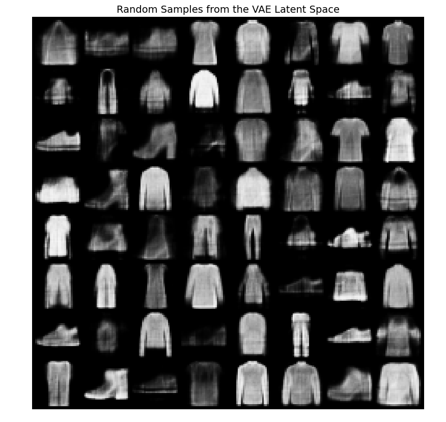
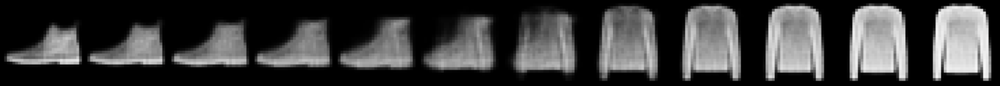
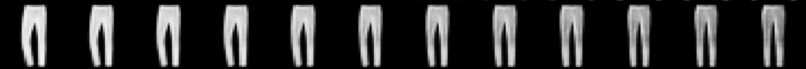
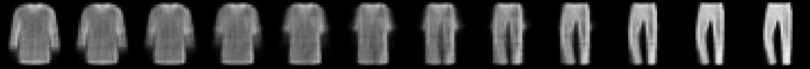
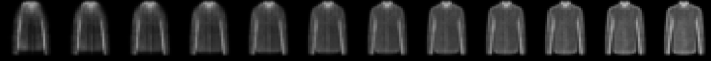
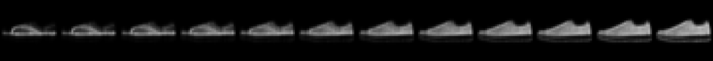

# Домашняя работа: Вариационный автоэнкодер (VAE)

**Студентка:** Большова Елизавета Александровна 

**Датасет:** Fashion-MNIST

**Курс:** Генеративные технологии для задач компьютерного зрения  

Целью данной работы является реализация, обучение и анализ Variational Autoencoder (VAE) на наборе данных Fashion-MNIST. Основная задача — изучить свойства латентного пространства модели, проверить её способность генерировать новые валидные сэмплы и продемонстрировать непрерывность выученного многообразия через интерполяцию.

---

## Анализ сгенерированных изображений

Для оценки генеративных способностей модели был выполнен сэмплинг 64 векторов из латентного пространства $z \sim \mathcal{N}(0, I)$. Результат представлен на рисунке ниже.

*Рис 1. Результат генерации новых образцов одежды (сетка 8x8).*

Все сгенерированные изображения классифицируются визуально. Можно четко отличить кроссовки от ботинок, а футболки от брюк. Модель успешно выучила распределение основных категорий одежды. 

**Артефакты:** Наблюдается характерная для VAE «замыленность». Это связано с использованием функции потерь BCE/MSE, которая усредняет значения пикселей. Однако структурных дефектов (разорванных контуров или хаотичных пятен) не выявлено.

---

## Анализ интерполяции в латентном пространстве

Ниже представлены результаты линейной интерполяции между парами тестовых изображений.

### Интерпретация результатов:

*   **Строка 1 (Ботинок → Свитер):** Демонстрирует плавную деформацию геометрии. Ботинок постепенно расширяется, формируя плечевую зону и горловину свитера. Переход происходит без резких скачков, промежуточные формы выглядят достаточно абстрактно.

*   **Строка 2 (Брюки со сгибом в коленке → Прямые брюки):** На исходном изображении брюки имеют выступ, имитирующий согнутую ногу. В процессе интерполяции этот изгиб плавно исчезает, и силуэт штанин становится более прямым и симметричным. Это показывает, что модель выучила не только фасон, но и вариативность поз/форм внутри категории.

*   **Строка 3 (Длинная футболка → Брюки):** Самый наглядный пример семантического обучения. Футболка в середине начинает плавно разделяться пополам, превращаясь в разрез между штанинами. Модель понимает топологическую разницу между этими классами.

*   **Строка 4 (Лонгслив → Свитер с воротником):** Демонстрирует изменение длины рукава и плотности изделия. Воротник становится более плотным, высоким и закрытым.

*   **Строка 5 (Сланцы → Ботинок):** Здесь интерполяция работает как регулятор конкретного признака — высоты. Постепенно надстраивается верхняя часть обуви, при этом подошва и общая форма носка остаются стабильными.

**Общий вывод по интерполяции:** Переходы максимально плавные. Странных или «мусорных» состояний между классами практически нет, что говорит о высокой плотности латентного пространства.

---

## Выводы о латентном пространстве VAE

1.  **Непрерывность и отсутствие дыр:** Латентное пространство VAE не просто кодирует картинки, а создает непрерывное поле смыслов. Двигаясь от одного объекта к другому, мы всегда проходим через визуально правдоподобные промежуточные формы.
2.  **Семантическое кодирование:** Модель самостоятельно выделила важные признаки (длина рукава, высота подошвы, наличие разреза) и научилась ими управлять.
3.  **Устойчивость к шуму:** Модель игнорирует мелкие шумы исходных данных, фокусируясь на глобальной форме объекта, что делает процесс генерации стабильным.
