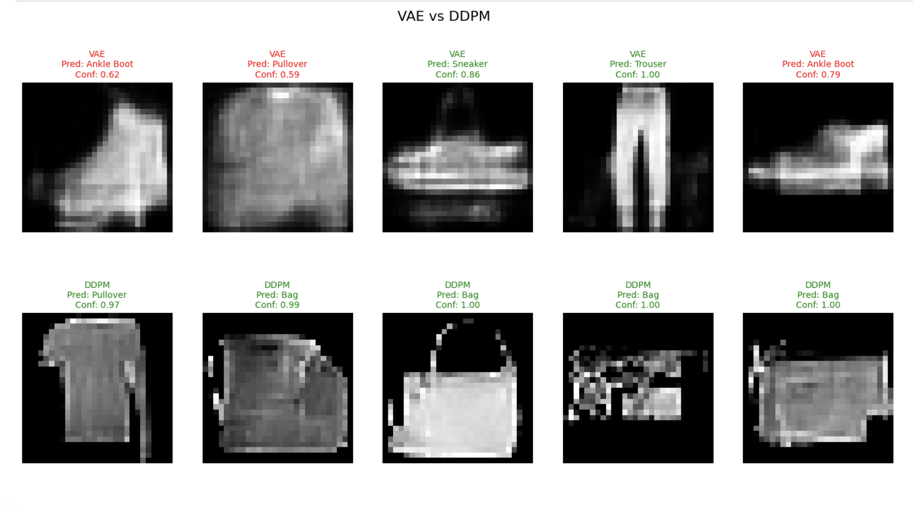

# Исследование качества генерации изображений (VAE vs DDPM)

**Студентка:** Большова Елизавета Александровна

**Датасет:** Fashion-MNIST

**Курс:** Генеративные технологии для задач компьютерного зрения

Целью работы является сравнительный анализ двух парадигм в генеративном компьютерном зрении: Вариационных автоэнкодеров (VAE) и Диффузионных вероятностных моделей (DDPM). Исследование направлено на выявление преимуществ диффузионного подхода в генерации детализированных изображений.

---

### Модель VAE
Модель строится на архитектуре кодировщика и декодировщика. Энкодер отображает входные данные в компактное латентное пространство, а декодер учится восстанавливать изображение из этого представления.
*   **Архитектура:** Полносвязная сеть (MLP) с латентным пространством $z=20$. 
*   **Особенности:** В качестве финальной активации использован `Tanh` для соответствия диапазону $[-1, 1]$.
*   **Обучение:** 20 эпох. Наблюдается характерное для VAE «замыливание» краев из-за оптимизации средней ошибки (MSE).

### Модель DDPM (Heavy UNet)
Процесс генерации основан на постепенном добавлении гауссовского шума к изображению до полного хаоса и последующем обучении нейросети восстанавливать структуру объекта шаг за шагом.
*   **Архитектура:** UNet с **ResNet-блоками** и **Group Normalization**. Общее число параметров: **2,194,689**.
*   **Процесс:** 500 шагов диффузии ($T=500$).
*   **Обучение:** 50 эпох. Время обучения на M4 Pro составило **76.16 минут**. Использование SiLU активаций и глубоких остаточных связей позволило модели выучить сложную структуру объектов.

---

## Методология оценки
Для объективного сравнения был обучен классификатор (CNN), достигший **93.56% точности** на реальных данных. Метрикой качества служила средняя уверенность классификатора при анализе 200 сгенерированных изображений от каждой модели, а также доля изображений с уверенностью выше 0.8.

## Сравнительные результаты

| Метрика | VAE (MLP) | DDPM (Heavy UNet) | Разница |
| :--- | :---: | :---: | :---: |
| Средняя уверенность классификатора | 0.7333 | **0.7932** | **+6%** |
| Доля качественных сэмплов (>0.8) | 0.4600 | **0.5650** | **+10.5%** |

### Визуальный анализ и интерпретация
1.  **Четкость деталей:** DDPM демонстрирует превосходство в генерации высокочастотных признаков. На сэмплах диффузии четко прослеживаются границы подошв обуви, воротники и текстура ткани, что практически недоступно для VAE из-за её склонности к усреднению пикселей.
2.  **Геометрическая точность:** Благодаря архитектуре UNet со сквозными связями (Skip-connections), DDPM лучше сохраняет симметрию и глобальную структуру одежды. 
3.  **Уверенность классификатора:** Доля «идеальных» (Confidence > 0.8) сэмплов у DDPM выше на 10.5%. Это подтверждает, что диффузионная модель создает данные, максимально приближенные к распределению реальных признаков, на которых обучался классификатор.

### Сравнительный анализ изображений

На рисунке 1 представлено сравнение предсказаний для обеих моделей. На каждое случайно выбранное изображение выведен вердикт классификатора и его уверенность.

*Рис 1. Сравнение предсказаний классификатора для VAE и DDPM.*

**Интерпретация:**
*   **VAE (верхний ряд):** Изображения имеют низкую контрастность и размытые контуры. В 60% случаев классификатор проявляет неуверенность (Confidence < 0.8, отмечено красным), так как отсутствие четких границ мешает точному выделению признаков.
*   **DDPM (нижний ряд):** Модель демонстрирует значительное преимущество. Несмотря на наличие легкого цифрового шума, геометрические параметры (ручки сумок, вырезы футболок) переданы настолько точно, что классификатор определяет классы с уверенностью **0.97 – 1.00**. 

Это подтверждает главный тезис работы: **диффузионные модели значительно лучше восстанавливают топологические особенности объектов**, что критически важно для систем распознавания образов.

## Заключение
В ходе работы подтверждено технологическое превосходство диффузионных моделей над вариационными автоэнкодерами для задач генерации изображений. Несмотря на значительно большие вычислительные затраты (76 минут против 1 минуты у VAE), DDPM обеспечивает качественно иной уровень детализации и семантической достоверности. 

**Итоговый вывод:** Диффузионный подход является более перспективным для создания детализированных изображений, в то время как VAE остаются эффективными для быстрого прототипирования и работы в условиях ограниченных ресурсов.
